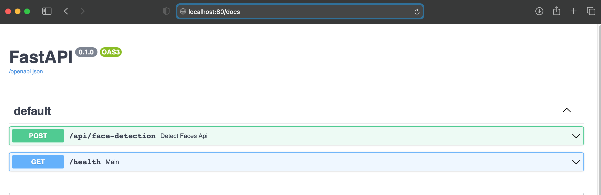
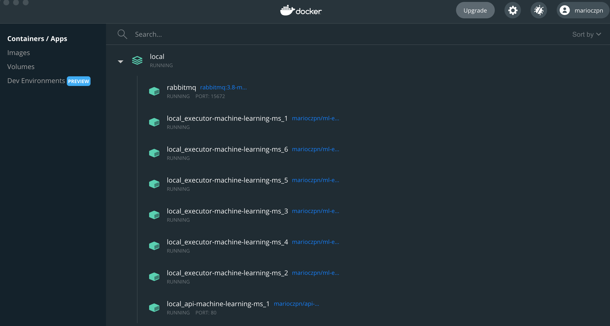
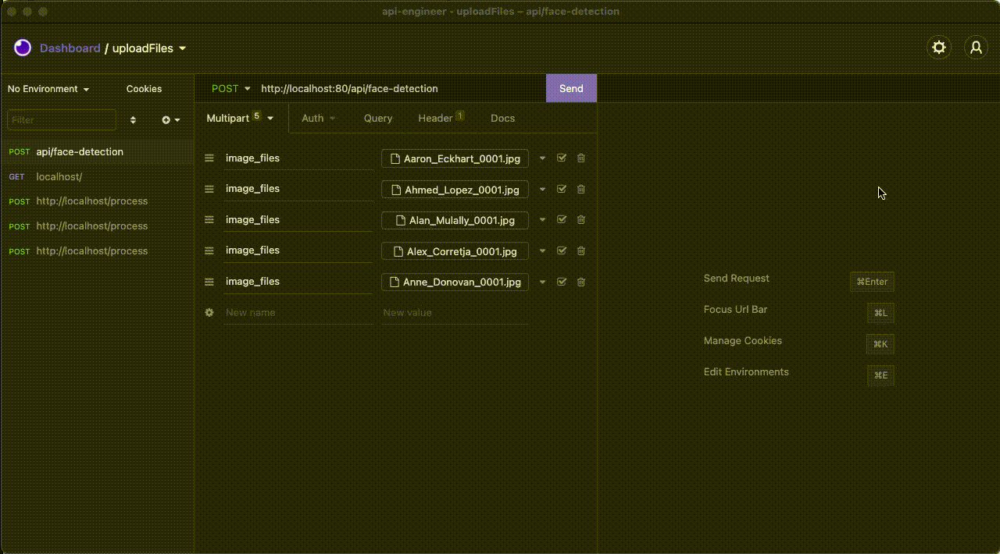

# Proposal solution to Microservice and Machine Learning Coding Challenge
 
This the solution for [ Machine Learning](executor-machine-learning-ms/app/services/mocksdk_service/README.md) proposed and it is composed by ***2-microservices*** communicating with RabbitMQ.


- ***Api:***  [api-machine-learning-ms](api-machine-learning-ms/README.md)
- ***Backend:*** [executor-machine-learning-ms](executor-machine-learning-ms/README.md) 

### Pre-Requisites

- [Docker](https://www.docker.com/products/docker-desktop)
- Python3

### How can start the application

Each application has your own DockerFile. But  was created a deploy/local to deploy the application using the [docker-compose.yaml](deploy/local/docker-compose.yaml) to deploy the application. 

But to simplify the work was created a [Makefile](Makefile) and there are many tasks there. However to put the application up and running just execute the following command:

```
make all; ./follow-app-local-logs.sh
```
  

>NOTE: If you want to **scale**  the executor(backend), you can increase the number of the instances changing the property  `NUM_INSTANCES_ML_EXECUTOR=6` placed on the [Makefile](Makefile) 


***Quick Tips:**
If everything is go right and you don't have postman to send the request, you can open the following url and add the files. ;) - http://localhost:80/docs

Example:


## Demonstration of the Solution

The following demonstration is showing the instances running on docker 




It's performing a test sending 5-images in the resquest to http://localhost:80/api/face-detection 



## Developed by:

* **Mario Ponciano** - [LinkedIn](https://www.linkedin.com/in/marioponciano/)
